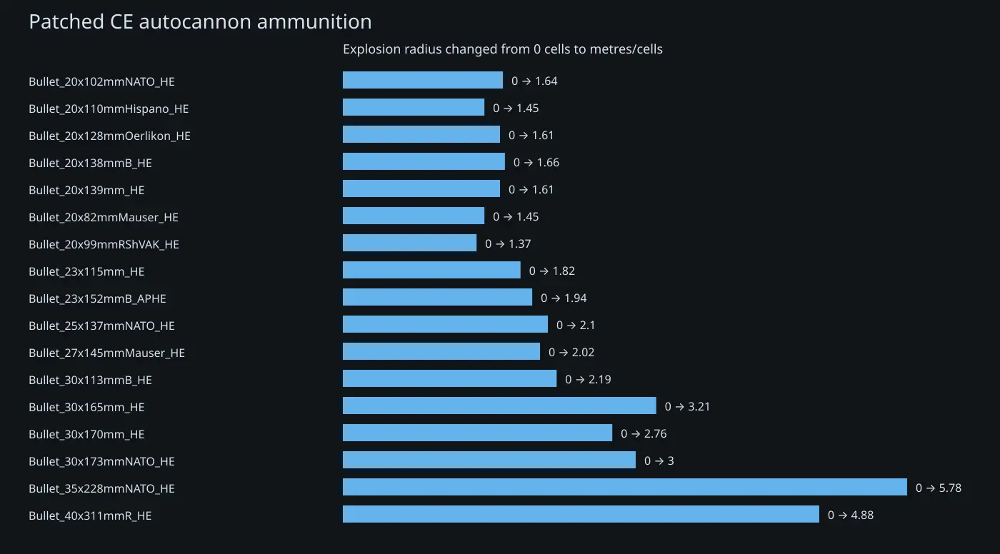

# CE Realistic Autocannon Explosions

## Patched autocannon ammunition

| Projectile ID              | CE damage | IRL TNT (g) | Radius (cells) |
| -------------------------- | --------: | ----------: | -------------: |
| Bullet_20x102mmNATO_HE     |        31 |        10.7 |              1 |
| Bullet_20x110mmHispano_HE  |        35 |           6 |              1 |
| Bullet_20x128mmOerlikon_HE |        35 |          10 |              1 |
| Bullet_20x138mmB_HE        |        35 |          11 |              1 |
| Bullet_20x139mm_HE         |        35 |          10 |              1 |
| Bullet_20x82mmMauser_HE    |        33 |           6 |              1 |
| Bullet_20x99mmRShVAK_HE    |        31 |           4 |              1 |
| Bullet_23x115mm_HE         |        44 |          15 |              1 |
| Bullet_23x152mmB_APHE      |        46 |          18 |              1 |
| Bullet_25x137mmNATO_HE     |        45 |          22 |              1 |
| Bullet_27x145mmMauser_HE   |        56 |          20 |              1 |
| Bullet_30x113mmB_HE        |        58 |          24 |              1 |
| Bullet_30x165mm_HE         |        71 |          49 |              1 |
| Bullet_30x170mm_HE         |        68 |          38 |              1 |
| Bullet_30x173mmNATO_HE     |        69 |          44 |              1 |
| Bullet_35x228mmNATO_HE     |        87 |         112 |              1 |
| Bullet_40x311mmR_HE        |       117 |          90 |              1 |

## Existing CE reference ammunition

| Projectile ID                                   | Ammo kind | Caliber (mm) | Radius (cells) |
| ----------------------------------------------- | --------- | -----------: | -------------: |
| Bullet_25x40mmGrenade_EMP                       | EMP       |           25 |            1.5 |
| Bullet_25x59mmGrenade_EMP                       | EMP       |           25 |            1.5 |
| Bullet_25x40mmGrenade_HE                        | HE        |           25 |              1 |
| Bullet_25x59mmGrenade_HE                        | HE        |           25 |              1 |
| Bullet_25x40mmGrenade_HE_TFuzed                 | HE-TF     |           25 |              1 |
| Bullet_25x59mmGrenade_HE_TFuzed                 | HE-TF     |           25 |              1 |
| Bullet_25x59mmGrenade_HEDP                      | HEDP      |           25 |            0.5 |
| Bullet_25x40mmGrenade_Smoke                     | Smoke     |           25 |              2 |
| Bullet_25x59mmGrenade_Smoke                     | Smoke     |           25 |              2 |
| Bullet_30x113mmBGrenade_EMP                     | EMP       |           30 |              2 |
| Bullet_30x29mmGrenade_EMP                       | EMP       |           30 |              2 |
| Bullet_30x113mmBGrenade_HE                      | HE        |           30 |              1 |
| Bullet_30x29mmGrenade_HE                        | HE        |           30 |              1 |
| Bullet_30x113mmBGrenade_HE_TFuzed               | HE-TF     |           30 |              1 |
| Bullet_30x29mmGrenade_HE_TFuzed                 | HE-TF     |           30 |              1 |
| Bullet_30x113mmBGrenade_HEDP                    | HEDP      |           30 |            0.5 |
| Bullet_30x29mmGrenade_HEDP                      | HEDP      |           30 |            0.5 |
| Bullet_30x64mmFuel_Incendiary                   | I         |           30 |              6 |
| Bullet_30x113mmBGrenade_Smoke                   | Smoke     |           30 |            2.5 |
| Bullet_30x29mmGrenade_Smoke                     | Smoke     |           30 |              2 |
| Bullet_35x32mmSRGrenade_EMP                     | EMP       |           35 |            1.5 |
| Bullet_35x32mmSRGrenade_HE                      | HE        |           35 |              1 |
| Bullet_35x32mmSRGrenade_HEDP                    | HEDP      |           35 |            0.5 |
| Bullet_35x32mmSRGrenade_Smoke                   | Smoke     |           35 |              2 |
| Bullet_37x223mmR_HE                             | HE        |           37 |              1 |
| Bullet_40x46mmGrenade_EMP                       | EMP       |           40 |            1.5 |
| Bullet_40x46mmGrenade_UNSCEMP                   | EMP       |           40 |            1.5 |
| Bullet_40x47mmGrenade_EMP                       | EMP       |           40 |              2 |
| Bullet_40x53mmGrenade_EMP                       | EMP       |           40 |            1.5 |
| Bullet_40x53mmVOG25Grenade_EMP                  | EMP       |           40 |              2 |
| Bullet_40x365mmBofors_HE                        | HE        |           40 |            1.5 |
| Bullet_40x46mmGrenade_HE                        | HE        |           40 |              1 |
| Bullet_40x47mmGrenade_HE                        | HE        |           40 |              1 |
| Bullet_40x53mmGrenade_HE                        | HE        |           40 |              1 |
| Bullet_40x53mmVOG25Grenade_HE                   | HE        |           40 |              1 |
| Bullet_40x365mmBofors_HE_TFuzed                 | HE-TF     |           40 |            1.5 |
| Bullet_40x46mmGrenade_HE_TFuzed                 | HE-TF     |           40 |              1 |
| Bullet_40x53mmGrenade_HE_TFuzed                 | HE-TF     |           40 |              1 |
| Bullet_40x53mmVOG25Grenade_HE_TFuzed            | HE-TF     |           40 |              1 |
| Bullet_40mmGrenade_UNSCHEDP                     | HEDP      |           40 |            1.5 |
| Bullet_40x46mmGrenade_HEDP                      | HEDP      |           40 |            0.5 |
| Bullet_40x53mmGrenade_HEDP                      | HEDP      |           40 |            0.5 |
| Bullet_40x46mmGrenade_Smoke                     | Smoke     |           40 |              2 |
| Bullet_40x46mmGrenade_UNSCSmoke                 | Smoke     |           40 |              2 |
| Bullet_40x47mmGrenade_Smoke                     | Smoke     |           40 |              2 |
| Bullet_40x53mmGrenade_Smoke                     | Smoke     |           40 |            2.5 |
| Bullet_40x53mmVOG25Grenade_Smoke                | Smoke     |           40 |            2.5 |
| Bullet_50mmGS50Grenade_EMP                      | EMP       |           50 |              2 |
| Bullet_50mmType89MortarShell_EMP                | EMP       |           50 |            2.5 |
| Bullet_50mmGS50Grenade_HE                       | HE        |           50 |              1 |
| Bullet_50mmRocket_HE                            | HE        |           50 |            2.5 |
| Bullet_50mmType89MortarShell_HE                 | HE        |           50 |            1.5 |
| Bullet_50mmType89MortarShell_Incendiary         | I         |           50 |            4.5 |
| Bullet_50mmGS50Grenade_Smoke                    | Smoke     |           50 |              2 |
| Bullet_50mmType89MortarShell_Smoke              | Smoke     |           50 |              3 |
| Bullet_57mmRocket_HE                            | HE        |           57 |              3 |
| Bullet_57mmRocket_HE_indirect                   | HE        |           57 |              3 |
| Bullet_57x307mmR_HE                             | HE        |           57 |              1 |
| Bullet_57x348mmSR_HE                            | HE        |           57 |            1.5 |
| Bullet_57x438mmBofors_HE                        | HE        |           57 |              2 |
| Bullet_57x348mmSR_HE_TFuzed                     | HE-TF     |           57 |            1.5 |
| Bullet_57x438mmBofors_HE_TFuzed                 | HE-TF     |           57 |              2 |
| Bullet_57mmRocket_HEAT                          | HEAT      |           57 |              1 |
| Bullet_57mmRocket_HEAT_indirect                 | HEAT      |           57 |              1 |
| Bullet_60mmMortarShell_EMP                      | EMP       |           60 |            3.5 |
| Bullet_60mmMortarShell_HE                       | HE        |           60 |              2 |
| Bullet_60mmMortarShell_Incendiary               | I         |           60 |            4.5 |
| Bullet_60mmMortarShell_Smoke                    | Smoke     |           60 |            4.5 |
| Bullet_66mmThermalBolt_Incendiary               | I         |           66 |            4.9 |
| Bullet_70mmMechanoidGrenade_EMP                 | EMP       |           70 |              5 |
| Bullet_70mmMechanoidGrenade_HE                  | HE        |           70 |            2.5 |
| Bullet_70mmAPKWS_HEAT                           | HEAT      |           70 |            1.5 |
| Bullet_75x350mmR_HE                             | HE        |           75 |              2 |
| Bullet_762x385mmRCannonShell_EMP                | EMP       |         76.2 |              4 |
| Bullet_762x385mmRCannonShell_HE                 | HE        |         76.2 |              2 |
| Bullet_762x539mmR_HE                            | HE        |         76.2 |              2 |
| Bullet_762x385mmRCannonShell_HEAT               | HEAT      |         76.2 |              1 |
| Bullet_80mmRocket_HE                            | HE        |           80 |              3 |
| Bullet_80mmRocket_HE_indirect                   | HE        |           80 |              3 |
| Bullet_80mmRocket_HEAT                          | HEAT      |           80 |            1.6 |
| Bullet_80mmRocket_HEAT_indirect                 | HEAT      |           80 |            1.6 |
| Ammo_80x256mmFuel_Incendiary                    | I         |           80 |              2 |
| Bullet_80x256mmFuel_Incendiary                  | I         |           80 |            6.5 |
| Bullet_81mmMortarShell_EMP                      | EMP       |           81 |            5.5 |
| Bullet_81mmMortarShell_HE                       | HE        |           81 |            2.5 |
| Bullet_81mmMortarShell_HE_HFuzed                | HE-TF     |           81 |              1 |
| Bullet_81mmMortarShell_Incendiary               | I         |           81 |            6.5 |
| Bullet_81mmMortarShell_Smoke                    | Smoke     |           81 |              6 |
| Bullet_83mmPIATGrenade_EMP                      | EMP       |           83 |              5 |
| Bullet_83mmPIATGrenade_HE                       | HE        |           83 |            2.5 |
| Bullet_83mmSMAW_HE                              | HE        |           83 |            2.5 |
| Bullet_83mmPIATGrenade_HEAT                     | HEAT      |           83 |              1 |
| Bullet_83mmSMAW_HEAT                            | HEAT      |           83 |              1 |
| Bullet_84x246mmR_EMP                            | EMP       |           84 |              5 |
| Bullet_84x246mmR_HE                             | HE        |           84 |            2.5 |
| Bullet_84x246mmR_HE_TFuzed                      | HE-TF     |           84 |            2.5 |
| Bullet_84mmAT4_HEAT                             | HEAT      |           84 |              1 |
| Bullet_84x246mmR_HEAT                           | HEAT      |           84 |              1 |
| Bullet_84x246mmR_HEDP                           | HEDP      |           84 |              1 |
| Bullet_84x246mmR_Incendiary                     | I         |           84 |              8 |
| Bullet_84x246mmR_Smoke                          | Smoke     |           84 |            5.5 |
| Bullet_88mmRPzB_HEAT                            | HEAT      |           88 |              1 |
| Bullet_90mmCannonShell_EMP                      | EMP       |           90 |              5 |
| Bullet_90mmCannonShell_HE                       | HE        |           90 |            2.5 |
| Bullet_90mmCannonShell_HE_TFuzed                | HE-TF     |           90 |            2.5 |
| Bullet_90mmCannonShell_HEAT                     | HEAT      |           90 |              1 |
| Bullet_90mmRCR_HEAT                             | HEAT      |           90 |              1 |
| Bullet_100x695mmRCannonShell_HE                 | HE        |          100 |              3 |
| Bullet_100x695mmRCannonShell_HEAT               | HEAT      |          100 |            1.5 |
| Bullet_105mmHowitzerShell_EMP                   | EMP       |          105 |            6.5 |
| Bullet_105mmHowitzerShell_EMP_directfire        | EMP       |          105 |            6.5 |
| Bullet_105mmHowitzerShell_HE                    | HE        |          105 |              3 |
| Bullet_105mmHowitzerShell_HE_directfire         | HE        |          105 |              3 |
| Bullet_105x607mmRShell_HE                       | HE        |          105 |              4 |
| Bullet_105x617mmRCannonShell_HE                 | HE        |          105 |              3 |
| Bullet_105mmHowitzerShell_HE_HFuzed             | HE-TF     |          105 |              3 |
| Bullet_105mmHowitzerShell_HEAT_directfire       | HEAT      |          105 |            1.5 |
| Bullet_105x607mmRShell_HEAT                     | HEAT      |          105 |            1.5 |
| Bullet_105x617mmRCannonShell_HEAT               | HEAT      |          105 |            1.5 |
| Bullet_105mmHowitzerShell_Incendiary            | I         |          105 |              8 |
| Bullet_105mmHowitzerShell_Incendiary_directfire | I         |          105 |              8 |
| Bullet_105mmHowitzerShell_Smoke                 | Smoke     |          105 |            8.5 |
| Bullet_105mmHowitzerShell_Smoke_directfire      | Smoke     |          105 |            8.5 |
| Bullet_120mmMortarShell_EMP                     | EMP       |          120 |            6.5 |
| Bullet_120mmCannonShell_HE                      | HE        |          120 |              4 |
| Bullet_120mmMortarShell_HE                      | HE        |          120 |            3.5 |
| Bullet_120mmMortarShell_HE_HFuzed               | HE-TF     |          120 |              1 |
| Bullet_120mmCannonShell_HEAT                    | HEAT      |          120 |            1.5 |
| Bullet_120mmMortarShell_Incendiary              | I         |          120 |             10 |
| Bullet_120mmMortarShell_Smoke                   | Smoke     |          120 |              8 |
| Bullet_130mmType63_HE                           | HE        |          130 |            3.5 |
| Bullet_132mmM13_HE                              | HE        |          132 |              4 |
| Bullet_15cmNebelwerfer_HE                       | HE        |          150 |            3.5 |
| Bullet_152mmHowitzerShell_EMP                   | EMP       |          152 |             10 |
| Bullet_152mmHowitzerShell_EMP_directfire        | EMP       |          152 |             10 |
| Bullet_152mmHowitzerShell_HE                    | HE        |          152 |            5.5 |
| Bullet_152mmHowitzerShell_HE_directfire         | HE        |          152 |            5.5 |
| Bullet_152mmHowitzerShell_HE_HFuzed             | HE-TF     |          152 |            5.5 |
| Bullet_152mmHowitzerShell_HEAT_directfire       | HEAT      |          152 |              2 |
| Bullet_152mmHowitzerShell_Incendiary            | I         |          152 |             12 |
| Bullet_152mmHowitzerShell_Incendiary_directfire | I         |          152 |             12 |
| Bullet_152mmHowitzerShell_Smoke                 | Smoke     |          152 |             11 |
| Bullet_152mmHowitzerShell_Smoke_directfire      | Smoke     |          152 |             11 |
| Bullet_155mmHowitzerShell_EMP                   | EMP       |          155 |            9.5 |
| Bullet_155mmHowitzerShell_EMP_directfire        | EMP       |          155 |            9.5 |
| Bullet_155mmHowitzerShell_HE                    | HE        |          155 |            5.5 |
| Bullet_155mmHowitzerShell_HE_directfire         | HE        |          155 |            5.5 |
| Bullet_155mmHowitzerShell_HE_HFuzed             | HE-TF     |          155 |            5.5 |
| Bullet_155mmHowitzerShell_Incendiary            | I         |          155 |           11.5 |
| Bullet_155mmHowitzerShell_Incendiary_directfire | I         |          155 |           11.5 |
| Bullet_155mmHowitzerShell_Smoke                 | Smoke     |          155 |           10.5 |
| Bullet_155mmHowitzerShell_Smoke_directfire      | Smoke     |          155 |           10.5 |
| Bullet_28cmSpgrShell_HE                         | HE        |          280 |              7 |
